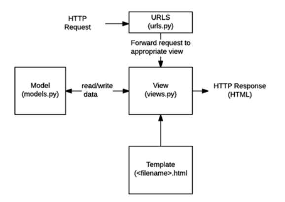

**[Visit deployed website](https://helven-marcia-burhansporty.pbp.cs.ui.ac.id)** 

<details>
<summary>1. Jelaskan bagaimana cara kamu mengimplementasikan checklist di atas secara step-by-step</summary>
<hr>

1. Membuat folder project baru dan mengaktifkan environment variable pada folder tersebut dengan:
    ```bash
    python -m venv .venv
    source .venv\Scripts\activate #saya menggunakan git bash terminal sehingga perlu menggunakan "source"
    ```
    Setelah itu saya menginisiasi django dengan menginstall library yang diperlukan di requirements.txt seperti pada tutorial 0 dan menginisiasi proyek baru dengan 
    ```bash
    django-admin startproject burhansporty
    ```
    Tidak lupa saya juga menambahkan file `.env` dan `.env.prod` serta beberapa adjustment di `settings.py` sesuai dengan arahan tutorial 0.

<hr>

2. Membuat aplikasi main dengan
    ```bash
    python manage.py startapp main
    ```
    Setelah itu saya tambahkan main ke INSTALLED_APPS di `settings.py`:
    ```python
    INSTALLED_APPS = [
        # bawaan Django...
        'main',
    ]
    ```

<hr>

3. Melakukan routing dengan menambahkan route/url baru pada `urls.py`
    ```python
    from django.contrib import admin
    from django.urls import path, include # menambahkan module include

    urlpatterns = [
        path('admin/', admin.site.urls),
        path('', include('main.urls')) # merouting base url "burhansporty/" ke main.urls
    ]
    ```

<hr>

4. Melakukan edit pada models.py untuk memenuhi criteria class model yang diperlukan dengan:
    ```python
    class Product(models.Model):
        id = models.UUIDField(primary_key=True, default=uuid.uuid4, editable=False)
        title = models.CharField(max_length=255)
        price = models.IntegerField()
        description = models.TextField()
        thumbnail = models.URLField()
        category = models.CharField()
        is_featured = models.BooleanField(default=False)
        sold = models.IntegerField(default=0)
        created_at = models.DateTimeField(auto_now_add=True)

        def __str__(self):
            return self.title
        
        @property
        def is_product_hot(self):
            return self.sold > 20
            
        def increment_sold(self):
            self.sold += 1
            self.save()
    ```

<hr>

5. Membuat fungsi pada `views.py` untuk mrender template serta memberikan context:
    ```python
    def show_main(request):
        context = {
            'app' : "BurhanSporty",
            'npm' : '2406359853',
            'name': 'Helven Marcia',
            'class': 'PBP C'
        }

        return render(request, "main.html", context)
    ```

<hr>

6. Melakukan routing pada `main/urls.py` 
    ```python
    from django.urls import path
    from main.views import show_main

    app_name = 'main'

    urlpatterns = [
        path('', show_main, name='show_main'), # 
    ]
    ```

<hr>

7. Melakukan inisiasi git, commit, serta push pada github beserta dengan pws. Tidak lupa menambahkan url deployment pws pada `ALLOWED_HOST` pada `settings.py`

<hr>

8. Membuat readme yang berisikan link ke website deployment
    ```markdown
    **[Visit deployed website](https://helven-marcia-burhansporty.pbp.cs.ui.ac.id)** 
    ```

</details>

<details>
<summary>2. Buatlah bagan yang berisi request client ke web aplikasi berbasis Django beserta responnya dan jelaskan pada bagan tersebut kaitan antara urls.py, views.py, models.py, dan berkas html.</summary>
<hr>



[Sumber: PPT PBP](https://scele.cs.ui.ac.id/pluginfile.php/269605/mod_resource/content/1/03%20-%20MTV%20Django%20Architecture.pdf)

<hr>
Diagram tersebut menjelaskan alur kerja arsitektur MTV pada Django. Saat pengguna mengirim HTTP Request, permintaan tersebut pertama kali diproses oleh urls.py untuk menentukan view yang sesuai. Selanjutnya, views.py akan menangani logika aplikasi, mengambil atau memproses data dari models.py jika diperlukan, lalu mengirimkan data tersebut ke template HTML. Template akan merender data menjadi halaman web, dan hasilnya dikirim kembali ke pengguna sebagai HTTP Response. Dengan demikian, urls.py berperan sebagai pengatur rute, views.py sebagai pengolah data dan penghubung, models.py sebagai pengelola database, dan berkas HTML sebagai penyaji informasi kepada pengguna.

<hr>
</details>

<details>
<summary>3. Jelaskan peran settings.py dalam proyek Django!</summary>
<hr>

Berkas settings.py dalam proyek Django berperan sebagai pusat konfigurasi utama aplikasi. Di dalamnya terdapat berbagai pengaturan penting, seperti konfigurasi database, aplikasi yang digunakan INSTALLED_APPS, middleware, template, static files, kunci rahasia SECRET_KEY, debug mode, serta pengaturan domain yang diizinkan ALLOWED_HOSTS. Django menggunakan settings.py untuk mengatur bagaimana proyek berjalan baik di lingkungan pengembangan maupun produksi, sehingga file ini menjadi komponen penting dalam mengontrol perilaku dan struktur keseluruhan aplikasi. 

<hr>
</details>

<details>
<summary>4. Bagaimana cara kerja migrasi database di Django?</summary>
<hr>

Migrasi database di Django adalah proses untuk menerapkan perubahan pada struktur database berdasarkan model yang didefinisikan di `models.py`. Saat kita membuat atau mengubah model, kita menjalankan perintah 
```bash
python manage.py makemigrations 
```
untuk membuat berkas migrasi yang berisi instruksi perubahan database. Kemudian, perintah 

```bash
python manage.py migrate 
```
digunakan untuk mengeksekusi instruksi tersebut sehingga struktur tabel di database diperbarui sesuai dengan model. Proses ini memastikan database selalu sinkron dengan definisi model tanpa perlu menulis query SQL secara manual.

<hr>
</details>

<details>
<summary>5. Menurut Anda, dari semua framework yang ada, mengapa framework Django dijadikan permulaan pembelajaran pengembangan perangkat lunak?</summary>
<hr>

Menurut saya, framework Django dijadikan permulaan pembelajaran pengembangan perangkat lunak karena Django menggunakan arsitektur Model-View-Template (MVT) yang memisahkan antara data, logika, dan tampilan, sehingga alur kerja aplikasi web menjadi lebih mudah dipahami. Selain itu, Django juga menyediakan banyak fitur bawaan seperti pengelolaan database, autentikasi pengguna, dan template engine, sehingga kita bisa fokus memahami konsep dasar pengembangan aplikasi tanpa harus membangun semuanya dari awal. Meskipun saya masih baru belajar, saya melihat Django membantu memberikan gambaran besar tentang bagaimana sebuah aplikasi web modern dibangun dan dijalankan.

<hr>
</details>

<details>
<summary>6. Apakah ada feedback untuk asisten dosen tutorial 1 yang telah kamu kerjakan sebelumnya?</summary>
<hr>

Tidak ada 😄

</details>


