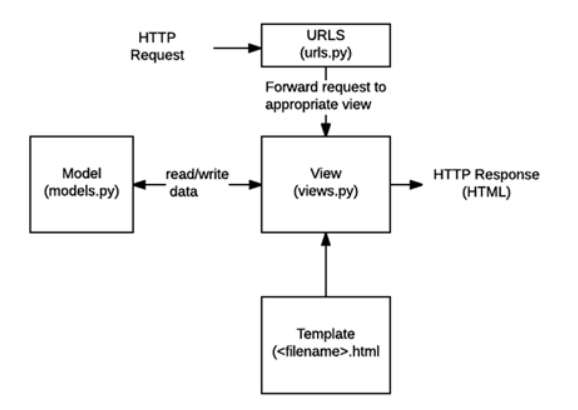
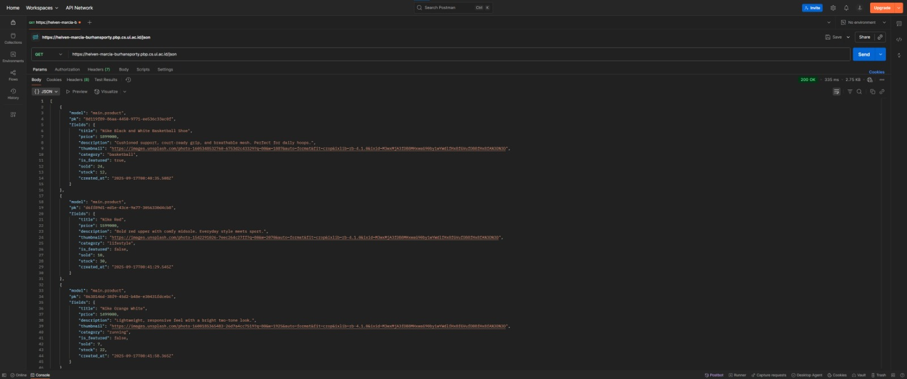
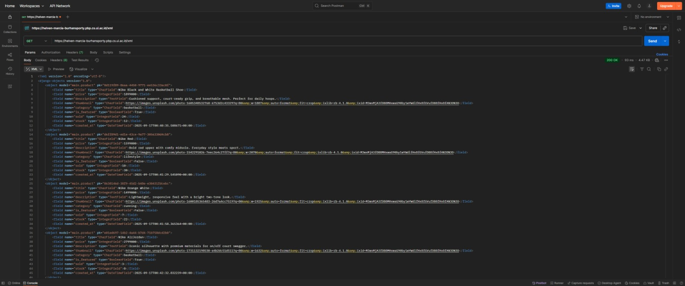
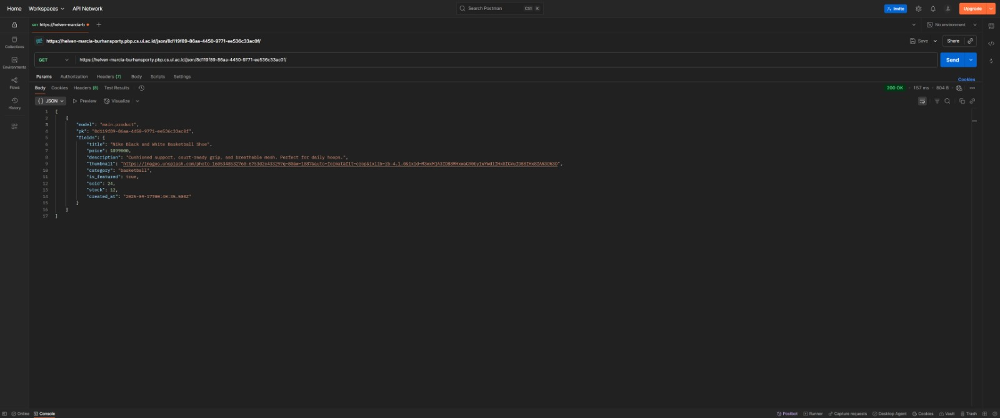
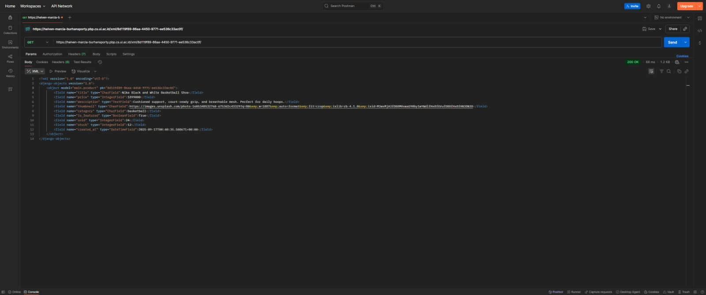
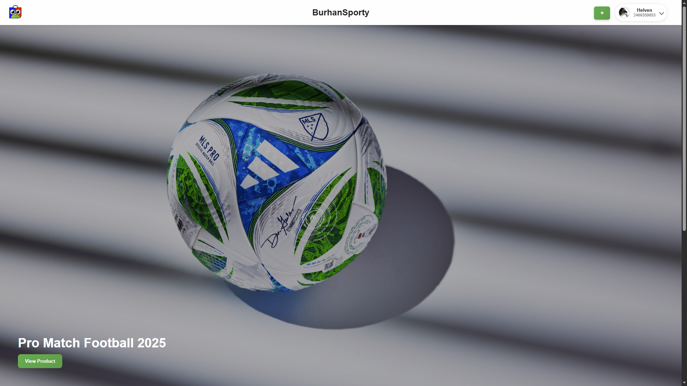
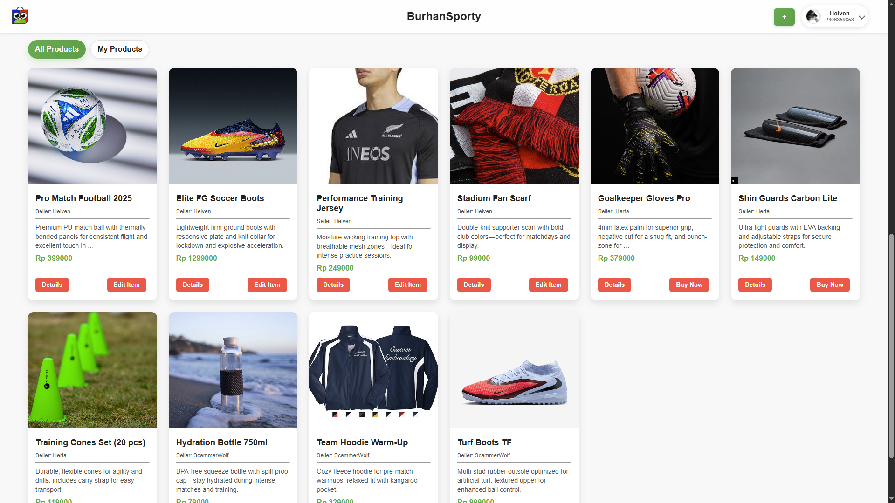
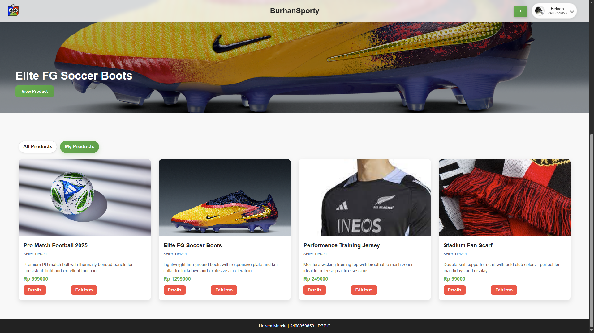

**[Visit deployed website](https://helven-marcia-burhansporty.pbp.cs.ui.ac.id)** 

<hr style="border:1px solid">

### Tugas 2

<details>
<summary>1. Jelaskan bagaimana cara kamu mengimplementasikan checklist di atas secara step-by-step</summary>
<hr>

1. Membuat folder project baru dan mengaktifkan environment variable pada folder tersebut dengan:
    ```bash
    python -m venv .venv
    source .venv\Scripts\activate #saya menggunakan git bash terminal sehingga perlu menggunakan "source"
    ```
    Setelah itu saya menginisiasi django dengan menginstall library yang diperlukan di requirements.txt seperti pada tutorial 0 dan menginisiasi proyek baru dengan 
    ```bash
    django-admin startproject burhansporty
    ```
    Tidak lupa saya juga menambahkan file `.env` dan `.env.prod` serta beberapa adjustment di `settings.py` sesuai dengan arahan tutorial 0.

<hr>

2. Membuat aplikasi main dengan
    ```bash
    python manage.py startapp main
    ```
    Setelah itu saya tambahkan main ke INSTALLED_APPS di `settings.py`:
    ```python
    INSTALLED_APPS = [
        # bawaan Django...
        'main',
    ]
    ```

<hr>

3. Melakukan routing dengan menambahkan route/url baru pada `urls.py`
    ```python
    from django.contrib import admin
    from django.urls import path, include # menambahkan module include

    urlpatterns = [
        path('admin/', admin.site.urls),
        path('', include('main.urls')) # merouting base url "burhansporty/" ke main.urls
    ]
    ```

<hr>

4. Melakukan edit pada models.py untuk memenuhi criteria class model yang diperlukan dengan:
    ```python
    class Product(models.Model):
        id = models.UUIDField(primary_key=True, default=uuid.uuid4, editable=False)
        title = models.CharField(max_length=255)
        price = models.IntegerField()
        description = models.TextField()
        thumbnail = models.URLField()
        category = models.CharField()
        is_featured = models.BooleanField(default=False)
        sold = models.IntegerField(default=0)
        created_at = models.DateTimeField(auto_now_add=True)

        def __str__(self):
            return self.title
        
        @property
        def is_product_hot(self):
            return self.sold > 20
            
        def increment_sold(self):
            self.sold += 1
            self.save()
    ```

<hr>

5. Membuat fungsi pada `views.py` untuk mrender template serta memberikan context:
    ```python
    def show_main(request):
        context = {
            'app' : "BurhanSporty",
            'npm' : '2406359853',
            'name': 'Helven Marcia',
            'class': 'PBP C'
        }

        return render(request, "main.html", context)
    ```

<hr>

6. Melakukan routing pada `main/urls.py` 
    ```python
    from django.urls import path
    from main.views import show_main

    app_name = 'main'

    urlpatterns = [
        path('', show_main, name='show_main'), # 
    ]
    ```

<hr>

7. Melakukan inisiasi git, commit, serta push pada github beserta dengan pws. Tidak lupa menambahkan url deployment pws pada `ALLOWED_HOST` pada `settings.py`

<hr>

8. Membuat readme yang berisikan link ke website deployment
    ```markdown
    **[Visit deployed website](https://helven-marcia-burhansporty.pbp.cs.ui.ac.id)** 
    ```

</details>

<details>
<summary>2. Buatlah bagan yang berisi request client ke web aplikasi berbasis Django beserta responnya dan jelaskan pada bagan tersebut kaitan antara urls.py, views.py, models.py, dan berkas html.</summary>
<hr>



[Sumber: PPT PBP](https://scele.cs.ui.ac.id/pluginfile.php/269605/mod_resource/content/1/03%20-%20MTV%20Django%20Architecture.pdf)

<hr>
Diagram tersebut menjelaskan alur kerja arsitektur MTV pada Django. Saat pengguna mengirim HTTP Request, permintaan tersebut pertama kali diproses oleh urls.py untuk menentukan view yang sesuai. Selanjutnya, views.py akan menangani logika aplikasi, mengambil atau memproses data dari models.py jika diperlukan, lalu mengirimkan data tersebut ke template HTML. Template akan merender data menjadi halaman web, dan hasilnya dikirim kembali ke pengguna sebagai HTTP Response. Dengan demikian, urls.py berperan sebagai pengatur rute, views.py sebagai pengolah data dan penghubung, models.py sebagai pengelola database, dan berkas HTML sebagai penyaji informasi kepada pengguna.

<hr>
</details>

<details>
<summary>3. Jelaskan peran settings.py dalam proyek Django!</summary>
<hr>

Berkas settings.py dalam proyek Django berperan sebagai pusat konfigurasi utama aplikasi. Di dalamnya terdapat berbagai pengaturan penting, seperti konfigurasi database, aplikasi yang digunakan INSTALLED_APPS, middleware, template, static files, kunci rahasia SECRET_KEY, debug mode, serta pengaturan domain yang diizinkan ALLOWED_HOSTS. Django menggunakan settings.py untuk mengatur bagaimana proyek berjalan baik di lingkungan pengembangan maupun produksi, sehingga file ini menjadi komponen penting dalam mengontrol perilaku dan struktur keseluruhan aplikasi. 

<hr>
</details>

<details>
<summary>4. Bagaimana cara kerja migrasi database di Django?</summary>
<hr>

Migrasi database di Django adalah proses untuk menerapkan perubahan pada struktur database berdasarkan model yang didefinisikan di `models.py`. Saat kita membuat atau mengubah model, kita menjalankan perintah 
```bash
python manage.py makemigrations 
```
untuk membuat berkas migrasi yang berisi instruksi perubahan database. Kemudian, perintah 

```bash
python manage.py migrate 
```
digunakan untuk mengeksekusi instruksi tersebut sehingga struktur tabel di database diperbarui sesuai dengan model. Proses ini memastikan database selalu sinkron dengan definisi model tanpa perlu menulis query SQL secara manual.

<hr>
</details>

<details>
<summary>5. Menurut Anda, dari semua framework yang ada, mengapa framework Django dijadikan permulaan pembelajaran pengembangan perangkat lunak?</summary>
<hr>

Menurut saya, framework Django dijadikan permulaan pembelajaran pengembangan perangkat lunak karena Django menggunakan arsitektur Model-View-Template (MVT) yang memisahkan antara data, logika, dan tampilan, sehingga alur kerja aplikasi web menjadi lebih mudah dipahami. Selain itu, Django juga menyediakan banyak fitur bawaan seperti pengelolaan database, autentikasi pengguna, dan template engine, sehingga kita bisa fokus memahami konsep dasar pengembangan aplikasi tanpa harus membangun semuanya dari awal. Meskipun saya masih baru belajar, saya melihat Django membantu memberikan gambaran besar tentang bagaimana sebuah aplikasi web modern dibangun dan dijalankan.

<hr>
</details>

<details>
<summary>6. Apakah ada feedback untuk asisten dosen tutorial 1 yang telah kamu kerjakan sebelumnya?</summary>
<hr>

Tidak ada 😄

</details>

<hr style="border:1px solid">

### Tugas 3

<details>
<summary>1. Jelaskan mengapa kita memerlukan data delivery dalam pengimplementasian sebuah platform?
</summary>
<hr>

Data delivery dibutuhkan agar pertukaran informasi antar komponen platform berlangsung rapi dan konsisten. Melalui mekanisme pengiriman yang teratur, data berpindah dari sumber ke tujuan tanpa hilang atau bocor, sekaligus tetap aman, cepat, akurat, dan dapat diukur kinerjanya.

Selain itu, data delivery memudahkan integrasi dengan layanan pihak ketiga karena ada cara yang jelas untuk mengirim dan menerima data. Dampaknya, platform bekerja lebih stabil, menyatu end-to-end, dan memberikan pengalaman penggunaan yang mulus.

<hr>
</details>

<details>
<summary>2. Menurutmu, mana yang lebih baik antara XML dan JSON? Mengapa JSON lebih populer dibandingkan XML?
</summary>
<hr>

Menurut saya, JSON memiliki keunggulan dibandingkan XML karena struktur penulisannya lebih sederhana dan mudah dimengerti, bahkan bagi orang yang belum terlalu berpengalaman. Bentuknya mirip dengan dictionary pada Python sehingga lebih intuitif untuk dipahami.

JSON juga lebih banyak digunakan dalam pertukaran data pada aplikasi maupun web modern. Popularitasnya tidak lepas dari sifatnya yang ringan, cepat diproses, serta dukungan yang luas pada berbagai bahasa pemrograman. Selain itu, JSON terintegrasi langsung dengan JavaScript sehingga penerapannya di lingkungan web menjadi lebih praktis dan efisien dibandingkan XML.

<hr>
</details>

<details>
<summary>3. Jelaskan fungsi dari method is_valid() pada form Django dan mengapa kita membutuhkan method tersebut?
</summary>
<hr>

Method is_valid() pada form Django berfungsi untuk memastikan data yang dimasukkan pengguna sesuai dengan aturan yang telah ditentukan pada form. Proses ini mencakup pengecekan kesesuaian tipe data, kelengkapan field, serta validasi terhadap constraint yang ada. Dengan begitu, data yang tidak sesuai akan ditandai sebagai tidak valid.

Kita memerlukan method ini agar hanya data yang aman dan benar yang diproses lebih lanjut. Tanpa validasi, data yang salah atau tidak sesuai format bisa menyebabkan error saat penyimpanan maupun ketika digunakan pada tahap berikutnya.

<hr>
</details>

<details>
<summary>4. Mengapa kita membutuhkan csrf_token saat membuat form di Django? Apa yang dapat terjadi jika kita tidak menambahkan csrf_token pada form Django? Bagaimana hal tersebut dapat dimanfaatkan oleh penyerang?
</summary>
<hr>

Penggunaan csrf_token dalam form Django bertujuan untuk melindungi aplikasi dari serangan Cross-Site Request Forgery (CSRF). Serangan ini memanfaatkan kondisi ketika seorang pengguna sudah login, lalu tanpa disadari mengirimkan permintaan berbahaya ke server melalui manipulasi dari pihak luar.

Dengan adanya csrf_token, Django dapat memverifikasi bahwa setiap permintaan POST benar-benar berasal dari form milik aplikasi kita, bukan dari situs lain. Jika token ini tidak disertakan, server tidak punya cara untuk membedakan apakah request sah atau hasil rekayasa penyerang. Akibatnya, penyerang bisa mengeksploitasi situasi tersebut untuk melakukan aksi tertentu atas nama pengguna, misalnya mengubah data penting atau menjalankan perintah yang tidak diinginkan.

<hr>
</details>

<details>
<summary>5. Jelaskan bagaimana cara kamu mengimplementasikan checklist di atas secara step-by-step (bukan hanya sekadar mengikuti tutorial).
</summary>
<hr>

1. Menambahkan 4 function baru pada `views.py` yaitu show_xml, show_json, show_xml_by_id, show_json_by_id
    ```python
    def show_xml(request):
    product_list = Product.objects.all()
    xml_data = serializers.serialize("xml", product_list)
    return HttpResponse(xml_data, content_type="application/xml")

    def show_json(request):
        product_list = Product.objects.all()
        json_data = serializers.serialize("json", product_list)
        return HttpResponse(json_data, content_type="application/json")

    def show_xml_by_id(request, product_id):
    try:
        product_item = Product.objects.filter(pk=product_id)
        xml_data = serializers.serialize("xml", product_item)
        return HttpResponse(xml_data, content_type="application/xml")
    except Product.DoesNotExist:
        return HttpResponse(status=404)

    def show_json_by_id(request, product_id):
    try:
        product_item = Product.objects.get(pk=product_id)
        json_data = serializers.serialize("json", [product_item])https://web.postman.co/home
        return HttpResponse(json_data, content_type="application/json")
    except Product.DoesNotExist:
        return HttpResponse(status=404)
    ```

<hr>

2. Menambahkan route pada `urls.py`
    ```python
    path('xml/', show_xml, name='show_xml'),
    path('json/', show_json, name='show_json'),
    path('xml/<str:product_id>/', show_xml_by_id, name='show_xml_by_id'),
    path('json/<str:product_id>/', show_json_by_id, name='show_json_by_id'),
    ```
<hr>

3. Membuat sebuah layout/skeleton dengan `templates/base.html`. Setelah itu melakukan sedikit penyesuaian pada `main.html` sehingga dapat extend pada layout. Tidak lupa juga menambahkan settings agar layout dapat diimplementasikan
    ```python
    ...
    TEMPLATES = [
        {
            'BACKEND': 'django.template.backends.django.DjangoTemplates',
            'DIRS': [BASE_DIR / 'templates'], # Tambahkan konten baris ini
            'APP_DIRS': True,
            ...
        }
    ]
    ...
    ```

<hr>

4. Membuat struktur form pada `forms.py`
    ```python
    from django.forms import ModelForm
    from main.models import Product

    class ProductForm(ModelForm):
        class Meta:
            model = Product
            fields = ["title", "price", "description", "thumbnail", "category", "is_featured", "sold", "stock"]
    ```

<hr>

5. Membuat function untuk melakukan render halaman add_product dan show_product_detail
    ```python
    def add_product(request):
        form = ProductForm(request.POST or None)

        if form.is_valid() and request.method == "POST":
            form.save()
            return redirect('main:show_main')

        context = {
            'form': form,
            'app' : "BurhanSporty",
            'npm' : '2406359853',
            'name': 'Helven Marcia',
            'class': 'PBP C'
        }
        return render(request, "add_product.html", context)

    def show_product_detail(request, id):
        product = get_object_or_404(Product, pk=id)

        context = {
            'product': product,
            'app' : "BurhanSporty",
            'npm' : '2406359853',
            'name': 'Helven Marcia',
            'class': 'PBP C'
        }

        return render(request, "product_detail.html", context)
    ```

<hr>

6. Membuat route untuk function render pada `urls.py`
    ```python
    path('add-product/', add_product, name='add_product'),
    path('products/<str:id>/', show_product_detail, name='show_product_detail'),
    ```

<hr>
</details>

<details>
<summary>6. Apakah ada feedback untuk asdos di tutorial 2 yang sudah kalian kerjakan?</summary>
<hr>

Tidak ada 😄

</details>

<hr>

#### Fetching JSON


#### Fetching XML


#### Fetching JSON by ID


#### Fetching XML by ID


<hr style="border:1px solid">

### Tugas 4

<details>
<summary>1. Apa itu Django AuthenticationForm? Jelaskan juga kelebihan dan kekurangannya.
</summary>
<hr>

Django AuthenticationForm adalah form bawaan yang disediakan oleh Django untuk menangani proses autentikasi pengguna, khususnya pada saat login. Form ini berada di modul `django.contrib.auth.forms` dan secara default menyediakan field username serta password yang sudah terhubung dengan sistem autentikasi Django. Kelebihan dari AuthenticationForm adalah kemudahannya karena tidak perlu membuat form login dari nol, sudah terintegrasi dengan backend autentikasi Django, serta dilengkapi validasi otomatis seperti pengecekan kecocokan username dan password, status akun aktif, hingga keamanan dasar terhadap serangan brute force dengan hashing password. Namun, kekurangannya adalah fleksibilitas yang terbatas karena form ini hanya menyediakan field standar username dan password, sehingga jika ingin menambahkan logika khusus atau field tambahan seperti login dengan email atau OTP, developer perlu melakukan kustomisasi atau membuat form turunan dari AuthenticationForm.

<hr>
</details>

<details>
<summary>2. Apa perbedaan antara autentikasi dan otorisasi? Bagaiamana Django mengimplementasikan kedua konsep tersebut?
</summary>
<hr>

Autentikasi adalah proses untuk memastikan identitas seseorang, yaitu langkah di mana sistem memverifikasi apakah pengguna benar-benar siapa yang ia klaim, biasanya melalui username, email, password, atau metode lain seperti token dan biometrik. Sedangkan otorisasi adalah tahap lanjutan setelah autentikasi berhasil, yaitu proses menentukan hak akses apa saja yang dimiliki pengguna tersebut di dalam sistem, misalnya apakah ia boleh melihat, mengubah, atau menghapus data tertentu. Dengan kata lain, autentikasi menjawab pertanyaan “siapa kamu?”, sementara otorisasi menjawab pertanyaan “apa yang boleh kamu lakukan?”.

<hr>
</details>

<details>
<summary>3. Apa saja kelebihan dan kekurangan session dan cookies dalam konteks menyimpan state di aplikasi web?
</summary>
<hr>

Cookies dan session sama-sama digunakan untuk menyimpan state di aplikasi web, tetapi mekanismenya berbeda. Cookies disimpan di sisi klien (browser) sehingga mudah diakses dan berguna untuk kebutuhan sederhana seperti preferensi pengguna atau data yang tidak sensitif. Kelebihannya adalah ringan, tidak membebani server, dan dapat bertahan meski browser ditutup. Kekurangannya adalah rawan dimanipulasi, terbatas ukurannya, dan tidak aman untuk menyimpan data sensitif meskipun bisa dienkripsi. Session, sebaliknya, menyimpan data di sisi server dengan hanya menyimpan session ID di cookie klien. Kelebihannya adalah lebih aman karena data asli tidak berada di browser, mendukung penyimpanan data lebih kompleks, dan mudah dikontrol masa aktifnya. Kekurangannya adalah menambah beban server karena harus menyimpan state setiap pengguna, serta dapat hilang jika session dihapus atau server tidak stabil.

<hr>
</details>

<details>
<summary>4. Apakah penggunaan cookies aman secara default dalam pengembangan web, atau apakah ada risiko potensial yang harus diwaspadai? Bagaimana Django menangani hal tersebut?
</summary>
<hr>

Penggunaan cookies tidak aman secara default, karena pada dasarnya cookies adalah data yang disimpan di browser pengguna dan bisa saja dilihat, dimodifikasi, atau dicuri jika tidak dijaga dengan benar. Risiko yang sering terjadi misalnya pencurian cookie saat terkirim lewat jaringan yang tidak aman, atau penyalahgunaan cookie oleh script berbahaya di browser.

<hr>
</details>

<details>
<summary>5. Jelaskan bagaimana cara kamu mengimplementasikan checklist di atas secara step-by-step (bukan hanya sekadar mengikuti tutorial).
</summary>
<hr>

1. Menambahkan 3 function baru pada `views.py` yaitu register, login_user, logout_user
    ```python
    def register(request):
        form = UserCreationForm()

        if request.method == "POST":
            form = UserCreationForm(request.POST)
            if form.is_valid():
                form.save()
                messages.success(request, 'Your account has been successfully created!')
                return redirect('main:login')
        context = {'form':form, 'app': "BurhanSporty"}
        return render(request, 'register.html', context)

    def login_user(request):
        if request.method == 'POST':
                form = AuthenticationForm(data=request.POST)

                if form.is_valid():
                    user = form.get_user()
                    login(request, user)
                    response = HttpResponseRedirect(reverse("main:show_main"))
                    response.set_cookie('last_login', str(datetime.datetime.now()))
                    return response

        else:
                form = AuthenticationForm(request)
        context = {'form': form, 'app': "BurhanSporty"}
        return render(request, 'login.html', context)

    def logout_user(request):
        logout(request)
        response = HttpResponseRedirect(reverse('main:login'))
        response.delete_cookie('last_login')
        return response
    ```

<hr>

2. Menambahkan route pada `urls.py`
    ```python
    path('register/', register, name='register'),
    path('login/', login_user, name='login'),
    path('logout/', logout_user, name='logout'),
    ```
<hr>

3. Menambahkan page untuk `register.html`, `login.html` dan beberapa action button.
    ```html
    ...
    <a class="logout" href="">Logout</a>
    ...
    ```

<hr>

4. Menambahkan gate/middleware untuk restriction akses page utama dan page lainnya
    ```python
    ...
    @login_required(login_url='/login')
    def show_main(request):
    ...
    @login_required(login_url='/login')
    def add_product(request):
    ...
    @login_required(login_url='/login')
    def show_product_detail(request, id):
    ...
    ```

<hr>

5. Menambahkan field user pada model Product (dan melakukan migrate)
    ```python
    ...
    from django.contrib.auth.models import User
    ...
    user = models.ForeignKey(User, on_delete=models.CASCADE, null=True)
    ...
    ```

<hr>

6. Melakukan penyesuaian tampilan pada page dengan mengedit file html

</details>

<hr>

#### Main Page


#### All Products List


#### My Products List



### Tugas 5

<details>
<summary>1. Jika terdapat beberapa CSS selector untuk suatu elemen HTML, jelaskan urutan prioritas pengambilan CSS selector tersebut!
</summary>
<hr>

Prioritas CSS ditentukan oleh tingkat spesifisitasnya. Aturan yang ditulis langsung di atribut elemen (inline style) memiliki prioritas paling tinggi, diikuti oleh selector berbasis ID, kemudian selector class, atribut, dan pseudo-class, lalu selector elemen atau tag. Selector universal, combinator, serta aturan yang diwariskan memiliki prioritas paling rendah. Jika terdapat dua aturan dengan tingkat spesifisitas yang sama, maka aturan yang ditulis paling akhir dalam urutan kode yang akan diterapkan.

<hr>
</details>

<details>
<summary>2. Mengapa responsive design menjadi konsep yang penting dalam pengembangan aplikasi web? Berikan contoh aplikasi yang sudah dan belum menerapkan responsive design, serta jelaskan mengapa!
</summary>
<hr>

Responsive design penting dalam pengembangan aplikasi web karena pengguna mengakses aplikasi melalui berbagai perangkat dengan ukuran layar berbeda, seperti smartphone, tablet, dan desktop. Dengan responsive design, tampilan dan fungsi aplikasi dapat menyesuaikan secara otomatis sehingga tetap nyaman digunakan, meningkatkan pengalaman pengguna, serta mendukung aksesibilitas.

<hr>
</details>

<details>
<summary>3. Jelaskan perbedaan antara margin, border, dan padding, serta cara untuk mengimplementasikan ketiga hal tersebut!
</summary>
<hr>

Margin, border, dan padding adalah bagian dari CSS box model yang mengatur ruang di sekitar elemen. Margin adalah jarak terluar yang memisahkan elemen dengan elemen lain di sekitarnya. Border adalah garis pembatas yang mengelilingi elemen dan berada di antara margin serta padding. Padding adalah ruang di dalam border yang memberi jarak antara konten elemen (seperti teks atau gambar) dengan garis border.

Dalam Tailwind CSS, implementasi margin, border, dan padding dilakukan dengan utility class. Margin menggunakan prefix m, misalnya m-4 untuk semua sisi atau mt-2 untuk margin atas. Padding menggunakan prefix p, misalnya p-6 untuk semua sisi atau px-3 untuk padding horizontal. Border menggunakan prefix border, misalnya border untuk border default, border-2 untuk ketebalan, border-red-500 untuk warna, dan rounded-lg jika ingin sudut melengkung.

<hr>
</details>

<details>
<summary>4. Jelaskan konsep flex box dan grid layout beserta kegunaannya!
</summary>
<hr>

Flexbox dan Grid Layout adalah dua sistem tata letak (layout) di CSS yang memudahkan pengaturan posisi elemen. Flexbox berfokus pada tata letak satu dimensi, yaitu mengatur elemen dalam baris (row) atau kolom (column). Flexbox sangat berguna untuk membuat alignment horizontal atau vertikal, mendistribusikan ruang antar elemen, serta membuat layout yang fleksibel sesuai ukuran layar, misalnya pada navbar, tombol, atau card yang tersusun rapi.

Sementara itu, Grid Layout berfokus pada tata letak dua dimensi, yaitu baris (rows) dan kolom (columns) sekaligus. Grid memungkinkan kita membuat struktur halaman yang kompleks dengan mudah, seperti membagi area header, sidebar, konten utama, dan footer. Kegunaannya sangat efektif untuk membuat layout halaman penuh atau komponen yang membutuhkan kontrol posisi lebih presisi.

<hr>
</details>

<details>
<summary>5. Jelaskan bagaimana cara kamu mengimplementasikan checklist di atas secara step-by-step (bukan hanya sekadar mengikuti tutorial).
</summary>
<hr>


1. Menambahkan setting pada `settings.py` untuk enabling penggunaan static
    ```python
    MIDDLEWARE = [
        'django.middleware.security.SecurityMiddleware',
        'django.contrib.sessions.middleware.SessionMiddleware',
        'django.middleware.common.CommonMiddleware',
        'django.middleware.csrf.CsrfViewMiddleware',
        'django.contrib.auth.middleware.AuthenticationMiddleware',
        'django.contrib.messages.middleware.MessageMiddleware',
        'django.middleware.clickjacking.XFrameOptionsMiddleware',
        'whitenoise.middleware.WhiteNoiseMiddleware', 
    ]
    ```
    ```python
    STATIC_URL = '/static/'
    if DEBUG:
        STATICFILES_DIRS = [
            BASE_DIR / 'static' # merujuk ke /static root project pada mode development
        ]
    else:
        STATIC_ROOT = BASE_DIR / 'static' # merujuk ke /static root project pada mode production
    ```
<hr>


2. Menambahkan import tailwind melalui script
    ```html
    ...
    <script src="https://cdn.tailwindcss.com"></script>
    ...
    ```
<hr>

3. Menambahkan 2 function baru pada `views.py` yaitu edit_product, delete_product
    ```python
    @login_required(login_url='/login')
    def edit_product(request, id):
        product = get_object_or_404(Product, pk=id)
        form = ProductForm(request.POST or None, instance=product)
        if form.is_valid() and request.method == 'POST':
            form.save()
            return redirect('main:show_main')

        context = {
            'form': form,
            'product': product,
            'app' : "BurhanSporty",
            'npm' : '2406359853',
            'name': request.user.username,
            'class': 'PBP C'
        }

        return render(request, "edit_product.html", context)

    @login_required(login_url='/login')
    def delete_product(request, id):
        product = get_object_or_404(Product, pk=id)
        product.delete()
        return HttpResponseRedirect(reverse('main:show_main'))
    ```

<hr>

4. Menambahkan route pada `urls.py`
    ```python
    path('products/<str:id>/edit', edit_product, name='edit_product'),
    path('products/<str:id>/delete', delete_product, name='delete_product'),
    ```
<hr>

5. Menambahkan page untuk `edit_product.html` dan 2 action button yang merujuk pada url edit dan delete.
    ```html
    ...
    <a href=""
        class="inline-flex items-center rounded-md bg-blue-600 text-white text-sm font-semibold px-3 py-2 hover:-translate-y-0.5 hover:shadow transition">
        Edit
    </a>
    <a href=""
        onclick="return confirm('Delete this product?');"
        class="inline-flex items-center rounded-md bg-red-600 text-white text-sm font-semibold px-3 py-2 hover:-translate-y-0.5 hover:shadow transition">
        Delete
    </a>
    ...
    ```

<hr>

6. Melakukan implementasi design. Karena pada week-week sebelumnya saya sudah melakukan implementasi design menggunakan internal CSS, pada tugas 5 ini saya hanya melakukan refactoring. Misalnya CSS seperti ini
    ```html
    <style>
        .btn {
            background: linear-gradient(135deg, #4CAF50, #45a049);
            border: none;
            border-radius: 6px;
            color: #fff;
            padding: 10px 18px;
            font-size: 15px;
            font-weight: 600;
            cursor: pointer;
            transition: all .25s ease-in-out;
            box-shadow: 0 3px 6px rgba(0,0,0,0.15);
        }
        .btn:hover {
            transform: translateY(-2px);
            box-shadow: 0 5px 10px rgba(0,0,0,0.2);
        }
        .btn:active {
            transform: translateY(0);
            box-shadow: 0 2px 5px rgba(0,0,0,0.15);
        }
    </style>
    ...
    <button class="btn">Add Product</button>

    ```
    Direfactor menggunakan tailwind menjadi
    ```html
    ...
    <button
        class="bg-gradient-to-br from-[#4CAF50] to-[#45a049]
            border-0 rounded-[6px] text-white
            px-[18px] py-[10px] text-[15px] font-semibold
            cursor-pointer transition-all duration-200
            shadow-[0_3px_6px_rgba(0,0,0,0.15)]
            hover:-translate-y-[2px] hover:shadow-[0_5px_10px_rgba(0,0,0,0.2)]
            active:translate-y-0 active:shadow-[0_2px_5px_rgba(0,0,0,0.15)]">
        Add Product
    </button>
    ...
    ```

</details>